# Google Cloud Platform

## Work Instruction for Create Custom Role in IAM

In this role I need permission for:
- resourcemanager.projects.get
- storage.buckets.list
- storage.multipartUploads.abort
- storage.multipartUploads.create
- storage.multipartUploads.list
- storage.multipartUploads.listParts
- storage.objects.create
- storage.objects.delete
- storage.objects.get
- storage.objects.list
- storage.objects.update

1. Go to IAM menu, and create custom role. 
  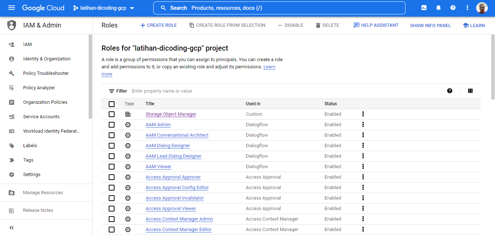  

2. Follow this option to fill the custom role permission. Then choose add permission.
  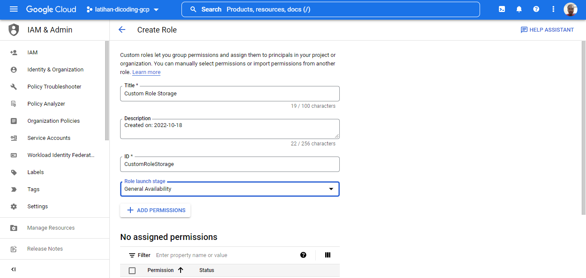  

3. Choose the permission based on list above this work instruction. Add this permission one by one.
  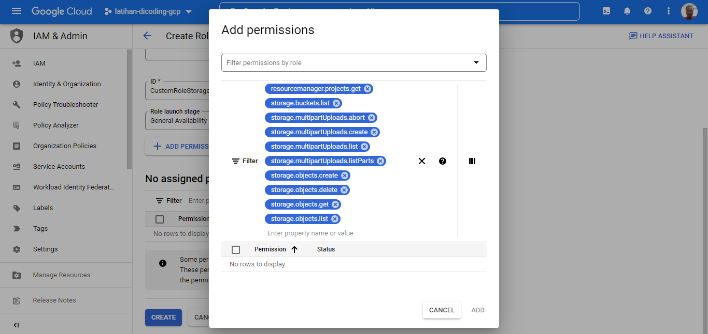  

4. Now we have 10 assigned permission for this role.
  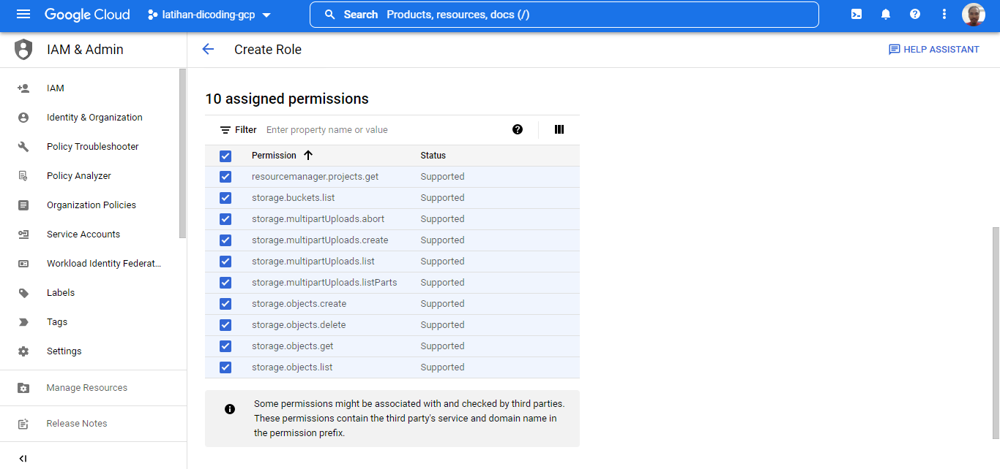  

5. Then click create
  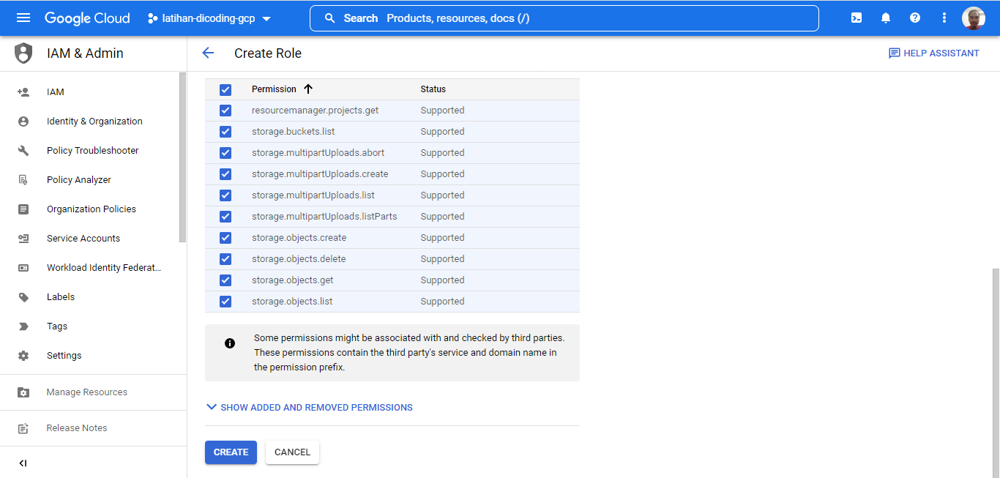  

6. Role was created.
  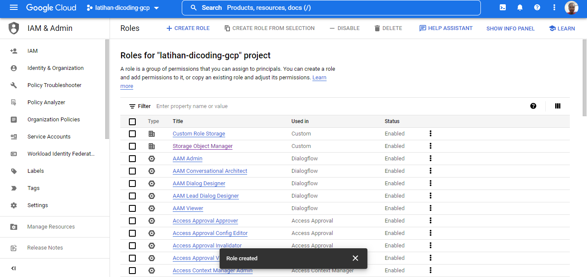  

Now we want to grant access for another google cloud account for our storage object resource based on custom role.

7. Go to IAM then click grant access.
  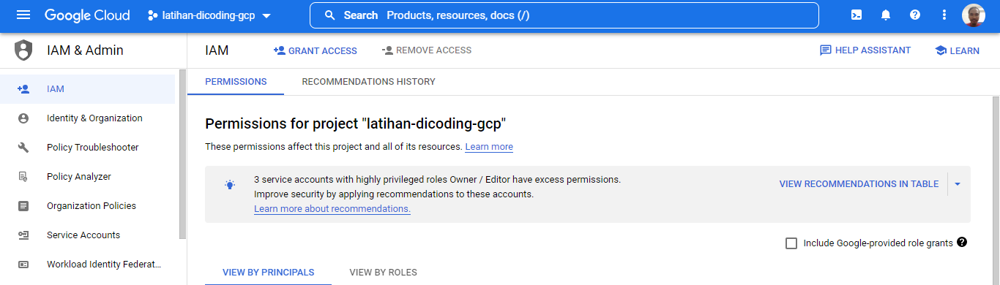  

8. Fill your another account. For this I am using another google account. Fill the “new principle” with your another account. Then assign role with custom role. And click save.
  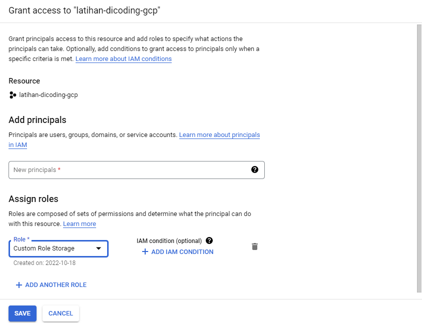  

9. Now I go to another account to test this role. Now you can see, in another account it have the project one. Choose this and go to cloud storage.
  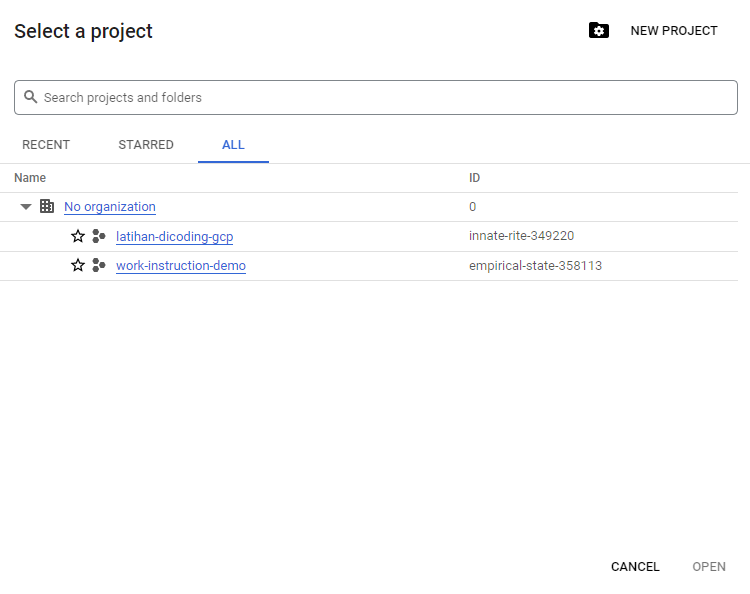  

10. Now I can access the cloud storage for this project.
  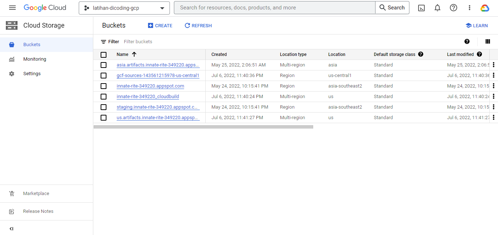  

11. I can go through in to the bucket too.
  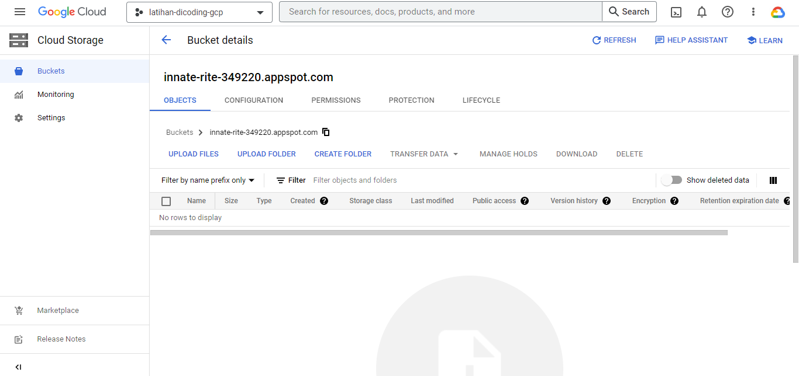  

12. Done, Thanks.
